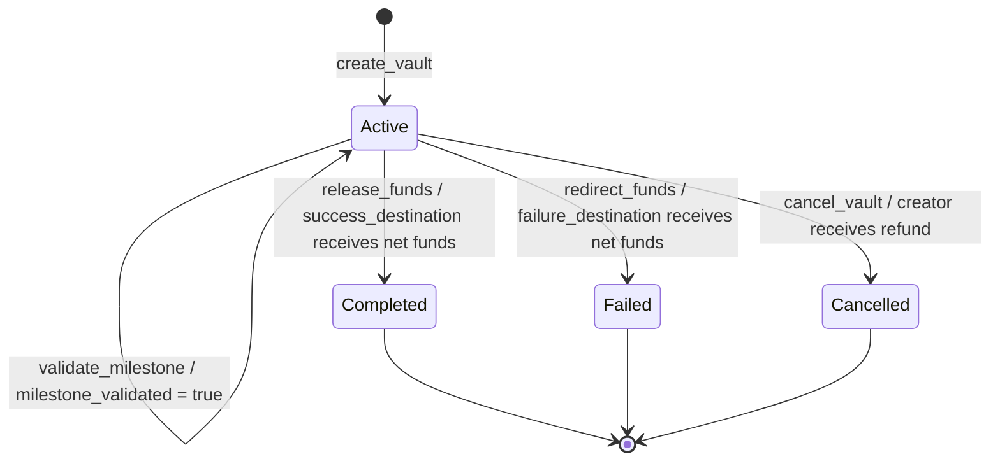

# Disciplr Vault Contract

Disciplr Vault is a Soroban contract for programmable USDC productivity vaults.
It locks funds for a milestone window and then routes them to the success
destination, failure destination, or back to the creator depending on the vault
lifecycle.

This README is the contract-facing reference for the current `src/lib.rs`
implementation. Backend integration payload examples live in [`src/doc.md`](src/doc.md),
and the machine-readable interface lives in
[`contract-interface.json`](contract-interface.json).

## Contract Entrypoints

| Entrypoint | Mutates state | Purpose |
| --- | --- | --- |
| `create_vault` | Yes | Creates and funds a new vault, assigns a sequential vault id, and starts it in `Active`. |
| `validate_milestone` | Yes | Marks an `Active` vault milestone as validated before the deadline. |
| `release_funds` | Yes | Sends net funds to `success_destination`, optionally routes a protocol fee, and moves the vault to `Completed`. |
| `redirect_funds` | Yes | Sends net funds to `failure_destination`, optionally routes a protocol fee, and moves the vault to `Failed`. |
| `cancel_vault` | Yes | Returns funds to the creator and moves the vault to `Cancelled`. |
| `get_vault_state` | No | Reads a vault record, returning `None` for an unknown id. |
| `vault_count` | No | Returns the number of vault ids assigned so far. |

## Error Codes

Soroban reports these variants as `Error(Contract, #N)`, where `N` is the
`repr(u32)` value defined on the `Error` enum in [`src/lib.rs`](src/lib.rs).
This table is cross-checked against [`contract-interface.json`](contract-interface.json)
and the backend mapping in [`src/doc.md`](src/doc.md#error-handling).

| Code | Variant | Entrypoint(s) | Trigger condition |
| --- | --- | --- | --- |
| `1` | `VaultNotFound` | `validate_milestone`, `release_funds`, `redirect_funds`, `cancel_vault` | No `ProductivityVault` exists for the supplied `vault_id`. `get_vault_state` returns `None` instead of raising this error. |
| `2` | `NotAuthorized` | `release_funds`, `redirect_funds` | `release_funds` is called before the vault is validated and before the deadline, or `redirect_funds` is called after the milestone was already validated. Address-level auth failures from `require_auth` surface as Soroban auth failures rather than this contract error. |
| `3` | `VaultNotActive` | `validate_milestone`, `release_funds`, `redirect_funds`, `cancel_vault` | The vault status is already terminal: `Completed`, `Failed`, or `Cancelled`. |
| `4` | `InvalidTimestamp` | `create_vault`, `redirect_funds` | `create_vault` receives a `start_timestamp` earlier than the current ledger timestamp, or `redirect_funds` is called at or before `end_timestamp`. The exact deadline case returns `#4`. |
| `5` | `MilestoneExpired` | `validate_milestone` | The current ledger timestamp is greater than or equal to `end_timestamp`, so validation is no longer allowed. |
| `6` | `InvalidStatus` | None in the current implementation | Reserved by the enum for invalid-status flows. Current state-changing entrypoints use `VaultNotActive` for non-`Active` vault states. |
| `7` | `InvalidAmount` | `create_vault` | `amount` is below `MIN_AMOUNT` or above `MAX_AMOUNT`. This covers zero, negative, and over-maximum amounts. |
| `8` | `InvalidTimestamps` | `create_vault` | `end_timestamp` is less than or equal to `start_timestamp`. |
| `9` | `DurationTooLong` | `create_vault` | `end_timestamp - start_timestamp` exceeds `MAX_VAULT_DURATION` (365 days). |
| `10` | `InvalidFee` | `create_vault`, settlement helpers | `fee_bps` exceeds `MAX_FEE_BPS` or checked fee math fails. |

## Protocol Fees

Vaults include a `ProtocolFeeConfig` at creation time. `fee_bps` is capped at
`MAX_FEE_BPS` (`1000`, or 10%) and `fee_recipient` receives the fee when
`release_funds` or `redirect_funds` settles the vault. The fee is rounded up in
the protocol's favor and deducted from the destination payout. `fee_bps == 0`
preserves the original behavior: the full vault amount goes to the success or
failure destination and no `fee_collected` event is emitted.

See [`docs/FEES.md`](docs/FEES.md) for the formula and worked examples.

## Vault Lifecycle

Vault records are never deleted by normal contract operation. A vault starts in
`Active`; `Completed`, `Failed`, and `Cancelled` are terminal states.

| From | To | Entrypoint | Preconditions | Resulting event |
| --- | --- | --- | --- | --- |
| None | `Active` | `create_vault` | Creator authorizes; amount and timestamps are valid; duration is within the maximum; token transfer into the contract succeeds. | `vault_created` |
| `Active` | `Active` | `validate_milestone` | Vault exists, is active, caller is the configured verifier or creator fallback, and ledger time is before `end_timestamp`. | `milestone_validated` |
| `Active` | `Completed` | `release_funds` | Creator authorizes; vault is active; milestone is validated or the deadline has been reached. | `fee_collected` when non-zero, then `funds_released` |
| `Active` | `Failed` | `redirect_funds` | Vault is active; ledger time is strictly greater than `end_timestamp`; milestone is not validated. | `fee_collected` when non-zero, then `funds_redirected` |
| `Active` | `Cancelled` | `cancel_vault` | Creator authorizes and vault is active. | `vault_cancelled` |

Any attempt to call `validate_milestone`, `release_funds`, `redirect_funds`, or
`cancel_vault` after a terminal transition returns `VaultNotActive` (`#3`).

## Source Of Truth

- [`src/lib.rs`](src/lib.rs) defines the enum values, transition guards, events,
  and storage writes.
- [`contract-interface.json`](contract-interface.json) mirrors the public ABI
  for integrators and tooling.
- [`src/doc.md`](src/doc.md) maps these contract semantics to backend API
  payloads and HTTP error responses.
